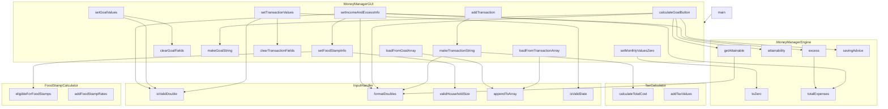

```mermaid
graph TD
    main ---> MoneyManagerGUI
    subgraph InputHandler
        isValidDouble
        formatDoubles
        validHouseholdSize
        appendToArray
        isValidDate
    end
    subgraph FoodStampCalculator 
        eligibleForFoodStamps
        addFoodStampRates
    end
    subgraph TaxCalculator 
        calculateTotalCost
        addTaxValues
    end
    subgraph MoneyManagerEngine
        toZero
        totalExpenses
        excess ---> totalExpenses
        attainability
        getAttainable ---> formatDoubles
        savingAdvice
    end
    subgraph MoneyManagerGUI
        setMonthlyValuesZero ---> toZero
        setIncomeAndExcessInfo ---> isValidDouble
        setIncomeAndExcessInfo ---> formatDoubles
        setIncomeAndExcessInfo ---> totalExpenses
        setIncomeAndExcessInfo ---> excess
        setIncomeAndExcessInfo ---> setFoodStampInfo
        setFoodStampInfo ---> validHouseholdSize
        setFoodStampInfo ---> eligibleForFoodStamps
        setGoalValues ---> isValidDouble
        setGoalValues ---> clearGoalFields
        calculateGoalButton ---> makeGoalString
        calculateGoalButton ---> attainability
        calculateGoalButton ---> getAttainable
        calculateGoalButton ---> savingAdvice
        calculateGoalButton ---> formatDoubles
        loadFromGoalArray ---> appendToArray
        setTransactionValues ---> isValidDouble
        setTransactionValues ---> clearTransactionFields
        setTransactionValues ---> isValidDate
        addTransaction ---> makeTransactionString
        makeTransactionString ---> calculateTotalCost
        makeTransactionString ---> formatDoubles
        loadFromTransactionArray ---> appendToArray
        clearTransactionFields
    end
```